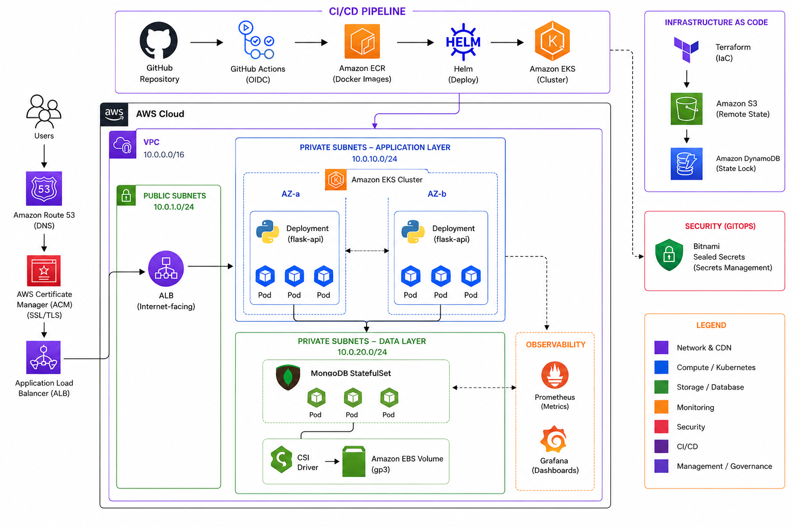

<div align="center">
  
  
  
  
  
  
  # 🚀 Enterprise-Grade Cloud-Native Ecosystem
  **Hybrid Infrastructure | EKS | GitOps | CI/CD | Observability | FinOps**
  
  *Um laboratório avançado de Engenharia de Plataforma e SRE, focado em automação de ponta a ponta e eficiência operacional na AWS.*

  [](https://github.com/alves-patrick/restapi-flask/actions)
  [](#)
  [](#)
  [](#)
  [](#)
</div>

---

## 🏗️ Arquitetura da Solução



*Diagrama detalhado da infraestrutura automatizada na AWS, integrando práticas de GitOps, Segurança e Observabilidade.*

---

## 🎯 Visão Estratégica do Projeto

Este projeto transcende a simples entrega de uma API. Ele representa a construção de uma **Plataforma de Dados Interna (IDP)** robusta, desenhada para suportar o ciclo de vida completo de uma aplicação moderna. O foco central foi garantir que a infraestrutura seja **segura**, **observável** e, acima de tudo, **financeiramente inteligente**.

### 🔗 Endpoints Públicos (Produção)
*   🚀 **API Flask (HTTPS):** [https://api.restapi-flask.xyz/users](https://api.restapi-flask.xyz/users)
*   📊 **Grafana Dashboard:** [https://grafana.restapi-flask.xyz](https://grafana.restapi-flask.xyz)

---

## 🏗️ Pilares de Engenharia & Decisões Técnicas

### 1. FinOps & Eficiência de Custos (O diferencial comercial)
Em vez de utilizar serviços gerenciados proprietários que oneram o orçamento, optei por uma estratégia de **In-Cluster Resources**:
*   **MongoDB via Helm:** Implantado com volumes persistentes **AWS EBS** (via EBS CSI Driver). Isso evita o custo inicial de ~$50/mês do AWS DocumentDB.
*   **Sealed Secrets vs. AWS KMS:** Implementei o Bitnami Sealed Secrets para gerenciar credenciais via GitOps. O KMS gera custos por cada chave e chamada de API; o Sealed Secrets oferece o mesmo nível de segurança assimétrica a **custo zero** e sem *Vendor Lock-in*.

### 2. Segurança Progressiva (Zero-Trust)
*   **Autenticação OIDC:** O GitHub Actions não utiliza chaves fixas. Ele assume permissões temporárias na AWS via tokens de confiança.
*   **EKS Access Entries:** Migração do legado `aws-auth` para o modelo moderno de entradas de acesso da AWS, garantindo que o gerenciamento de permissões do cluster seja 100% via código (IaC).

### 3. Observabilidade Proativa
*   **Stack Prometheus & Grafana:** Implementação da `kube-prometheus-stack` para monitoramento de saúde.
*   **Capacidade Técnica:** Configuração de Dashboards automáticos para visualização de consumo de CPU/RAM por Namespace e Nodes, permitindo uma resposta rápida a incidentes de performance.

---

## 🛠️ Automação & DX (Developer Experience)

O projeto foi construído para que o desenvolvedor gaste tempo **codando**, não operando. O **Makefile** age como a fachada de comando único:

| Comando | Descrição Técnica | Impacto no Negócio |
| :--- | :--- | :--- |
| `make dev` | Provisiona cluster Kind local, Ingress Nginx, MongoDB e a App. | **Aceleração:** Ambientes de dev idênticos à prod em segundos. |
| `make test` | Roda testes unitários com **Pytest** e Linting com **Flake8**. | **Qualidade:** Garante que o código segue os padrões antes do commit. |
| `make aws-up` | Provisiona VPC, EKS, Route 53, ACM e faz o deploy total. | **Agilidade:** Infraestrutura de produção pronta em um comando. |
| `make aws-down` | **Economic Teardown:** Destrói apenas os recursos caros (EKS/Nodes/ALB). | **Economia:** Mantém DNS e Rede ativos, reduzindo custos em 95%. |

---

## ⚙️ CI/CD: Esteira de Automação "Self-Service"

O repositório utiliza o GitHub Actions para orquestrar dois fluxos críticos:

### A. CI/CD Unificado (Continuous Deployment)
Cada `git push` na branch `main` dispara um fluxo inteligente:
1.  **Gate de Qualidade:** O robô testa e analisa o código. Se falhar, o deploy é bloqueado.
2.  **Build Imutável:** Imagem Docker construída, tagueada com o SHA do commit e enviada ao Amazon ECR.
3.  **Deployment Atômico:** Atualização do cluster EKS via Helm com **Zero Downtime**.

### B. Infra-as-Code Manual Triggers (Controle Total)
Graças ao **Terraform Remote State (S3 + DynamoDB Lock)**, o painel do GitHub possui botões para:
*   🚀 **Apply:** Ligar a infraestrutura completa remotamente.
*   🛑 **Destroy:** Desligar os recursos caros para preservar créditos da AWS.

---

## 🔌 Documentação da API (RESTful)

A API gerencia um cadastro de usuários com persistência em banco de dados e validações matemáticas de documentos.

### Endpoints Disponíveis:
*   **GET `/users`**: Lista todos os usuários cadastrados.
*   **POST `/user`**: Cria um novo usuário.
    ```json
    {
      "first_name": "Patrick", "last_name": "Alves",
      "cpf": "123.456.789-00", "email": "patrick.devops@outlook.com",
      "birth_date": "1990-01-01"
    }
    ```
*   **PATCH `/user`**: Atualiza dados de um usuário existente via CPF.
*   **DELETE `/user/<cpf>`**: Remove um registro permanentemente.

---

## 🤝 Contato

Desenvolvido por **Patrick Alves** - *Focado em soluções de Alta Disponibilidade, Automação e Cloud Computing.*

<div align="left">
  <a href="https://www.linkedin.com/in/patrickalvesdev/" target="_blank">
    
  </a>
  <a href="mailto:patrick.devops@outlook.com">
    
  </a>
</div>
